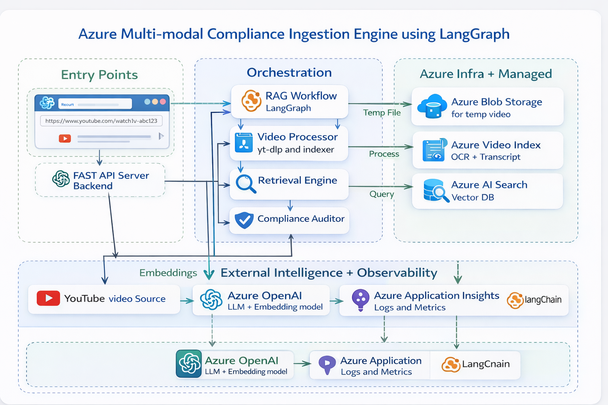
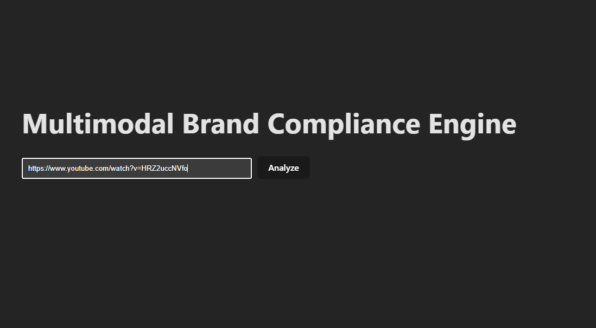
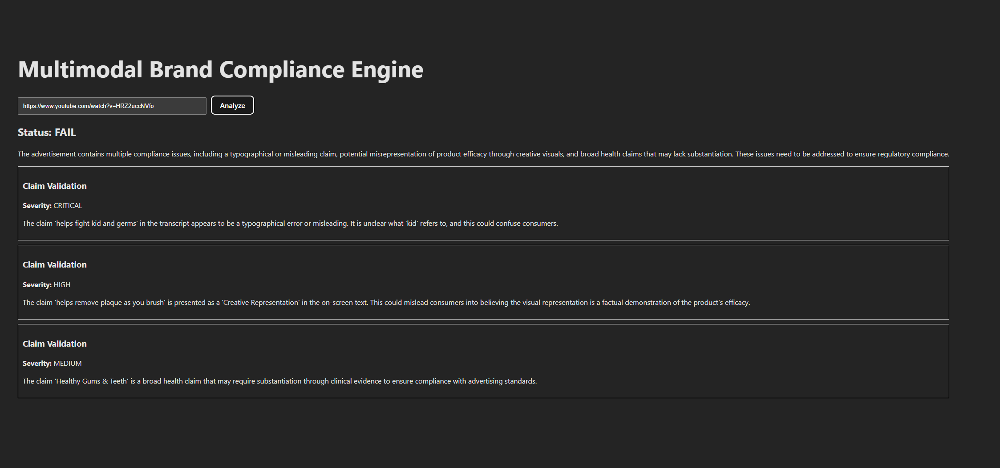
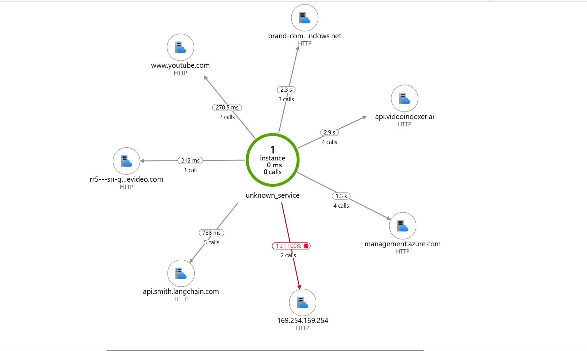

# Multimodal Brand Compliance Engine

Enterprise-grade multimodal LLMOps system for automated brand and regulatory compliance analysis of marketing videos using RAG, vector search, and Azure AI services.

---

## 📌 Overview

The **Multimodal Brand Compliance Engine** is an end-to-end AI system that automatically audits marketing videos for brand and regulatory violations.

It leverages multimodal AI, retrieval-augmented generation (RAG), and cloud-based LLM orchestration to generate structured compliance reports with severity levels and recommendations.

This project demonstrates real-world LLMOps architecture including:

- Multimodal processing
- Embedding-based retrieval
- Vector search
- LLM orchestration
- Observability
- Cloud deployment design

---

## 🏗 Architecture

### High-Level Flow

1. 🎥 Video ingestion (YouTube URL input)
2. 📝 Transcript extraction
3. 🧠 Compliance rule embedding generation
4. 🔎 Vector similarity search (RAG retrieval)
5. 🤖 LLM-based compliance reasoning
6. 📊 Structured JSON compliance report
7. 📡 Observability & logging

---

## 🧰 Tech Stack

### Backend

- FastAPI
- Python
- LangGraph (LLM orchestration)
- Azure OpenAI
- Azure AI Search (Vector DB)
- Azure Application Insights

### Frontend

- React (Vite)
- Axios

### AI Concepts Used

- Multimodal processing
- Retrieval-Augmented Generation (RAG)
- Embedding-based similarity search
- Prompt engineering
- Structured output generation
- Observability & latency tracking

---

## 📊 Sample Output

```json
{
  "video_id": "ad_1023",
  "compliance_status": "FAIL",
  "violations": [
    {
      "category": "Unsubstantiated Claims",
      "severity": "CRITICAL",
      "confidence": 0.89,
      "recommendation": "Provide clinical evidence for health-related claims."
    }
  ],
  "final_report": "The advertisement contains unsupported health benefit claims."
}
```

---

## 🏗 System Architecture

The following diagram illustrates the end-to-end multimodal compliance pipeline including frontend entry, backend orchestration, Azure-managed services, and observability components.

<p align="center">
  
</p>

Key Highlights:

- React frontend for YouTube URL submission
- FastAPI backend for orchestration
- LangGraph-based RAG workflow
- Azure OpenAI for reasoning & embeddings
- Azure AI Search for vector retrieval
- Azure Video Indexer for transcript + OCR
- Azure Application Insights for observability

---

## 🎨 Frontend UI

The React-based frontend allows users to submit a YouTube video link and receive structured compliance analysis results.

<p align="center">
  
</p>

Features:

- YouTube URL input
- Loading state during processing
- PASS / FAIL compliance indicator
- Categorized violation breakdown
- Severity-level classification

---

## 📑 Compliance Result Output

Structured compliance report generated by the LLM orchestration pipeline.

<p align="center">
  
</p>

The system returns:

- Compliance status
- Violation categories
- Severity levels (CRITICAL / MAJOR / MINOR)
- Explanation and recommendations
- Confidence score

---

## 📡 Observability – Azure Application Insights

The system integrates Azure Application Insights to monitor:

- API request latency
- Dependency calls
- Error tracking
- Application Map
- Performance metrics

<p align="center">
  
</p>

This ensures production-grade monitoring and traceability across the LLM pipeline.

---
